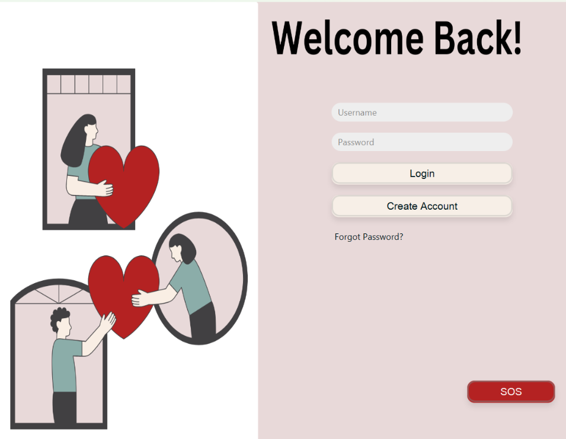
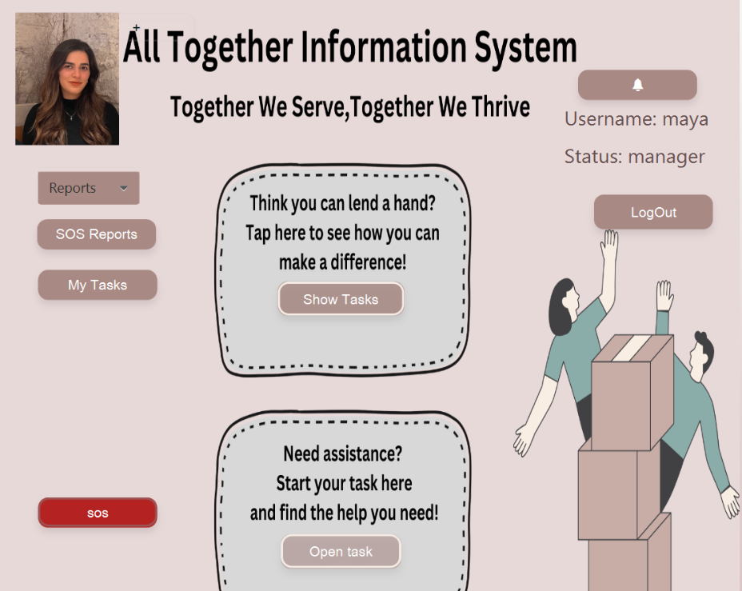

# All Together Information System

Together Information System is a comprehensive software solution designed to facilitate efficient volunteering and task management within a community. This project consists of multiple modules including user management, task handling, and emergency reporting.

## Table of Contents

- [Project Overview](#project-overview)
- [Features](#features)
- [Installation](#installation)
- [Usage](#usage)
- [Contributing](#contributing)
- [Contact](#contact)

## Project Overview

Together Information System is aimed at helping communities manage volunteer tasks and handle emergency situations effectively. The system includes functionalities for user registration and authentication, task creation and management, and a reporting system for emergencies.

This project was developed as part of a course in Software Engineering. The team consists of 6 participants: **Samih, Aseel, Mary, Mery, Nawal, and Maya**.

## Features

- **User Management**: Register, login, and manage user profiles.
- **Task Management**: Create, assign, and track tasks within the community.
- **Emergency Reporting**: Report and respond to emergencies quickly and efficiently.
- **Data Management**: Manage data securely with the integrated database manager.

## Installation

To install and run the project locally, follow these steps:

1. **Clone the repository**:
    ```sh
    git clone https://github.com/aseel1/Prototype.git
    ```

2. **Set up the database**:
   - Ensure you have a compatible database system installed.
   - Configure the database connection in `DatabaseManager.java`.

3. **Compile and run the project**:
   - Using a Java IDE like IntelliJ IDEA or Eclipse:
      - Import the project.
      - Build and run the project from the IDE.

   - Using the command line:
     ```sh
     javac -d bin src/*.java
     java -cp bin Main
     ```

## Usage

### User Registration and Login



- Users can register and log in to access the system.
- Upon logging in, users can view and manage tasks and respond to emergency reports.

### Task Management



- Create new tasks and assign them to users.
- Track task progress and update task status.

### Volunteering

- Users can volunteer for tasks created by the community.
- Managers can track the status of volunteered tasks and update completion status.

### Emergency Reporting

- Report emergencies using the emergency button available on the dashboard.
- Respond to emergency alerts and provide assistance.

## Contributing

We welcome contributions from the community. To contribute:

1. Fork the repository.
2. Create a new branch (`git checkout -b feature-branch`).
3. Make your changes and commit them (`git commit -m 'Add new feature'`).
4. Push to the branch (`git push origin feature-branch`).
5. Open a pull request.

Please ensure your code adheres to the project's coding standards and includes relevant tests.

## Contact


For any questions or suggestions, please contact any of us:

- **Maya Atwan**: [maya.atwan.2000@gmail.com](mailto:maya.atwan.2000@gmail.com)
- **Aseel Shaheen**: [AseelShaheen1@gmail.com](mailto:AseelShaheen1@gmail.com)
- **Mery Shalabi**: [merryshalabi59@gmail.com](mailto:merryshalabi59@gmail.com)
- **Mary Qubty**: [maryq1-99@hotmail.com](mailto:maryq1-99@hotmail.com)
- **Samih Warwar**: [samih.warwar@gmail.com](mailto:samih.warwar@gmail.com)
- **Nawal Khoury**: [Nawalkhoury20@gmail.com](mailto:Nawalkhoury20@gmail.com)
